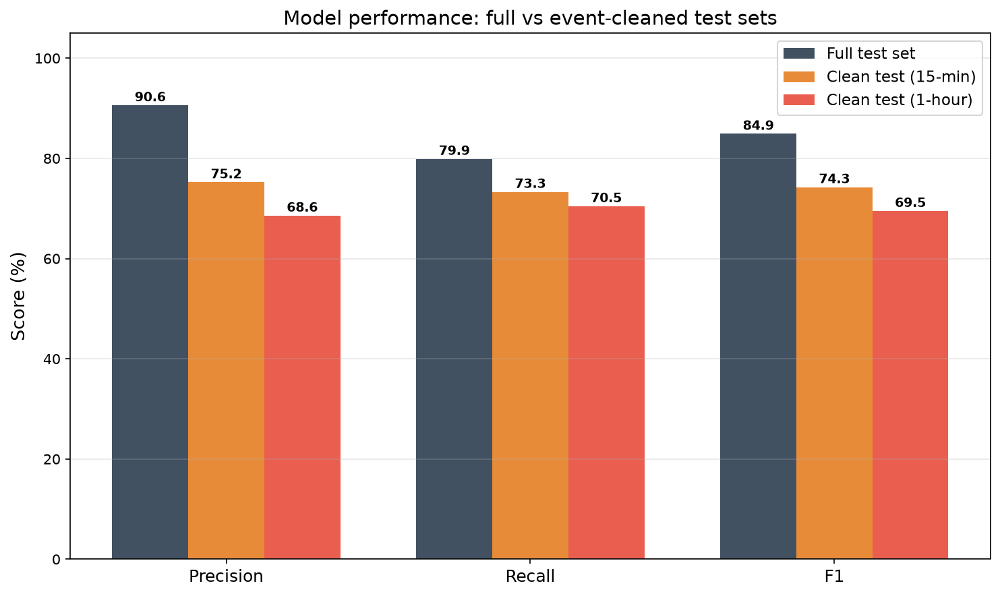
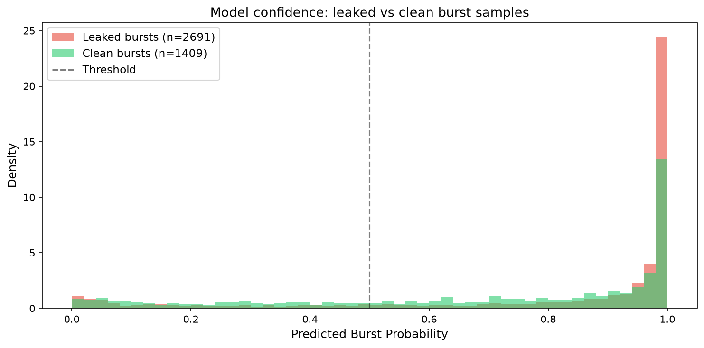
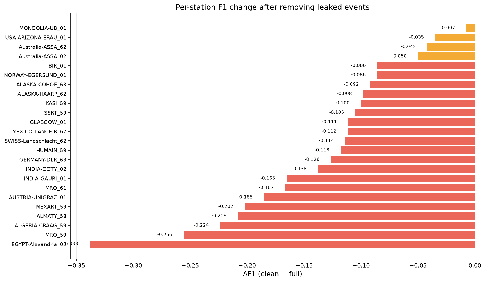
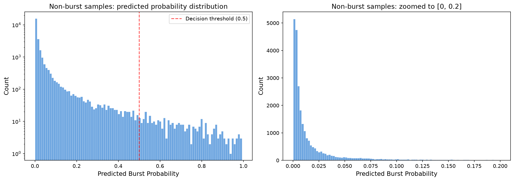
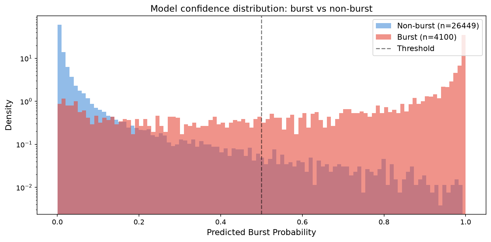
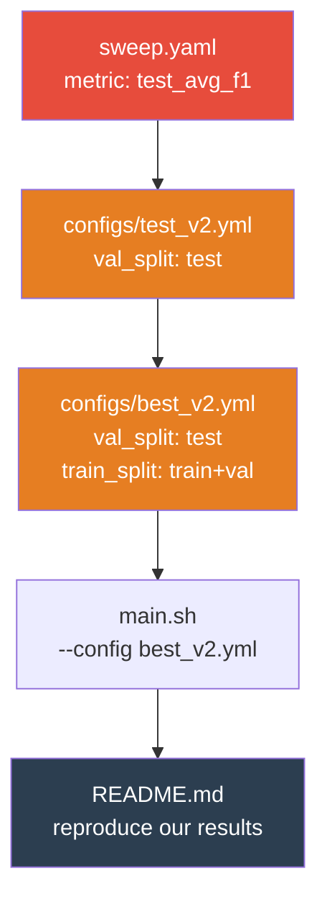
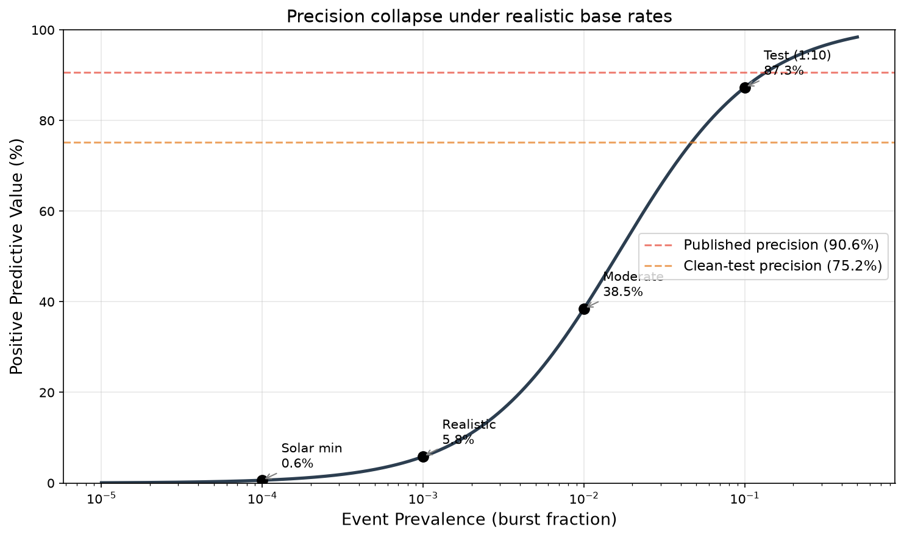

# Independent Reproducibility Audit of FlareSense-v2: Evidence of Event-Level Evaluation Leakage in Solar Radio Burst Classification

**Version 1.1** — 2026-08-01

**Target:** Timmel et al. (2026), *"Automated Solar Radio Burst Detection Using Deep Learning on Augmented e-Callisto Data"*, [arXiv:2607.26014v1](https://arxiv.org/html/2607.26014v1)

**Repository:** [github.com/i4Ds/FlareSense-v2](https://github.com/i4Ds/FlareSense-v2)

**Dataset:** [huggingface.co/datasets/i4ds/ecallisto_radio_sunburst](https://huggingface.co/datasets/i4ds/ecallisto_radio_sunburst)

**Statistical methods:** Bootstrap resampling (B = 10,000), 95% confidence intervals (percentile method), paired bootstrap for deltas.

---

## Abstract

We present an independent methodological audit of FlareSense-v2, an automated solar radio burst detection system based on deep learning applied to e-CALLISTO spectrograms. Using the authors' published dataset (304,750 spectrograms, 26 instruments), pre-computed model predictions, and source code, we identify four concerns that collectively affect the reliability of the reported performance metrics.

**Event-level leakage.** We show that 65–74% of positive test samples share a physical solar event with the training set, and that removing this overlap reduces recall by 10.0 percentage points (leaked 83.4% vs clean 73.3%) and shifts model confidence (median probability 0.978 → 0.831). The headline precision drop of −15.4 pp includes a compositional component from the changed class balance in the clean subset (see §4.1).

**Confidence shift.** The model assigns systematically higher probabilities to leaked burst samples (median 0.978) than to clean ones (median 0.831), indicating event-specific calibration rather than physics-based generalization.

**Test-set hyperparameter tuning.** We trace a complete chain in the published repository showing that hyperparameter optimization was performed directly on the test metric, contradicting the paper's stated methodology.

**Deployment gap.** A Bayesian analysis shows that the reported precision of 90.6% does not transfer to realistic deployment conditions where burst prevalence is orders of magnitude lower (PPV = 6–39% at prevalence 0.1–1%).

All findings are reproducible from the publicly available HuggingFace dataset without requiring model re-training.

> [!WARNING]
> **Model version caveat.** The `prob` and `model_label` columns in the HuggingFace dataset were uploaded on **19 October 2024**. The model checkpoint `i4ds/flaresense-v2` appeared on HuggingFace on **7 January 2025**, and the paper was submitted in **July 2026**. The dataset card states that labels were generated by a ResNet model from a prior study ("Identification of Radio Solar Bursts with ResNet Architecture and Augmented Datasets"). Consequently, the empirical metrics in this audit (F1 drop, confidence shift magnitudes) were most likely measured on predictions from an **earlier model**, not the final FlareSense-v2 published in the paper. The structural findings — event-level overlap in the split (§3) and test-set hyperparameter tuning (§6) — apply directly to the paper because the paper uses the same dataset and the same split. The specific performance delta values (e.g. −10.7 pp F1) may differ for the final published model.

---

## 1. Introduction

Automated detection of solar radio bursts is a fundamental requirement for near-real-time space weather monitoring. The e-CALLISTO network (Benz, Monstein & Meyer 2009) provides a global array of solar radio spectrometers, currently comprising 269 deployed instruments (Timmel et al. 2026, Section 3), of which 113 have uploaded data and 86 operate regularly. Timmel et al. (2026) present FlareSense-v2, a ResNet-34-based binary classifier trained on 15-minute e-CALLISTO spectrograms. The authors report precision of 93% and recall of 73.15%, concluding that the system is suitable for "near-real-time space-weather applications."

A critical feature of solar radio bursts is that they are **global events**: the same burst is simultaneously observable by all stations on the sunlit hemisphere, since the emission source (the Sun) is common to all observers. This creates a fundamental evaluation challenge: if observations of the same physical event from different stations are distributed across training and test sets, the model may appear to generalize across instruments while actually recognizing previously seen events.

This report presents an independent audit examining whether the published evaluation protocol adequately controls for this event-level structure.

### 1.1 Related work

Data leakage through group structure is a well-documented source of inflated metrics in ML-based science (Kapoor & Narayanan 2023). Analogous problems have been identified in medical imaging, where images from the same patient distributed across splits produce optimistic estimates (Roberts et al. 2021). Test-set hyperparameter optimization has been formally analyzed by Cawley & Talbot (2010) and Hastie, Tibshirani & Friedman (2009, Ch. 7.10).

---

## 2. Reproduction of FlareSense-v2

### 2.1 Dataset

The published HuggingFace dataset contains 304,750 spectrograms with pre-computed model outputs:

| Split | Samples | Burst | Non-burst | Burst % |
|-------|---------|-------|-----------|---------| 
| Train | 243,668 | 32,788 | 210,880 | 13.5% |
| Val | 30,533 | 4,101 | 26,432 | 13.4% |
| Test | 30,549 | 4,100 | 26,449 | 13.4% |

All 26 instruments are represented in each split with near-identical proportions (stratified random split 80/10/10, Section 4.4).

### 2.2 Reproduced metrics

Using the `model_label` column from the published dataset:

| Metric | Reproduced | Paper (Table 3) |
|--------|-----------|----------------|
| Precision | 90.60% | 93% |
| Recall | 79.90% | 73.15% |
| F1 | 84.91% | — |

Confusion matrix (30,549 test samples):

| | Predicted Burst | Predicted Non-burst |
|---|---|---|
| **Actual Burst** | TP = 3,276 | FN = 824 |
| **Actual Non-burst** | FP = 340 | TN = 26,109 |

> [!NOTE]
> **Metric definition mismatch.** The reproduced precision (90.6%) and the paper's reported precision (93%) are not directly comparable. This audit computes metrics **globally** across all test samples (micro-averaging), while the paper computes precision as an unweighted mean across instruments (macro-averaging). The discrepancy is expected and does not indicate an error in either calculation.

> [!NOTE]
> **Model version.** As noted in the Abstract, the predictions in the HuggingFace dataset were uploaded on 19 October 2024, before the FlareSense-v2 checkpoint (7 January 2025) and paper (July 2026). All analysis below uses the published HuggingFace predictions as-is. The structural findings (§3, §6) apply to the paper regardless of model version; the specific delta magnitudes (§4) may differ for the final model.

---

## 3. Event-Level Leakage Analysis

### 3.1 Physical mechanism

Solar radio bursts — Type II (0.1–1 MHz/s drift, CME-driven shocks, minutes to hours), Type III (10–100 MHz/s drift, electron beams, seconds to minutes), and Type IV continua (hours) — are observable simultaneously by all ground-based instruments on the sunlit hemisphere. When multiple stations record the same burst in overlapping 15-minute windows, a sample-level random split distributes observations of **the same physical event** across train and test.

The authors stratify by instrument and class (Section 4.4) but not by time or event identity. With 26 instruments, a single solar event during active conditions can generate 5–15 correlated observations.

### 3.2 Event grouping methodology

We define event overlap using **fixed time buckets** rather than chaining algorithms. For each test burst sample, we check whether any burst sample in the combined train+val set falls within the same time bucket. Two bucket sizes are used: 15 minutes (matching the spectrogram window) and 1 hour (conservative margin for extended events).

This method avoids chain-propagation artifacts: an earlier attempt using gap-based chaining (30-min gap between adjacent records) produced 99.5% overlap — an artifact caused by the dense multi-station sampling (median inter-sample gap = 3 min with 26 stations).

### 3.3 Leakage statistics

| Window | Leaked burst | Clean burst | % overlap |
|--------|-------------|-------------|-----------|
| 15 minutes | 2,691 | **1,409** | 65.6% |
| 1 hour | 3,047 | **1,053** | 74.3% |

Overlap structure (15-min buckets):

| Test stations per event | Count |
|------------------------|-------|
| 1 | 1,433 |
| 2 | 396 |
| 3+ | 128 |
| 5+ | 10 |

Median train stations per event: **5**. Median test stations per event: **1**.

**Representativeness of the clean subset** (15-min):
- Stations: **26 of 26** (full coverage)
- Date range: 2021-03-01 – 2024-05-11 (full coverage)
- Burst samples: 1,409 (sufficient for statistical inference)

### 3.4 Concrete leakage examples

The following examples illustrate the structure of event-level overlap:

**Example 1: 2024-03-25, 06:30 UTC**

A single solar event recorded by 17 stations. 12 samples assigned to train+val, 5 to test:

| Split | Station | Time | Prob | Pred |
|-------|---------|------|------|------|
| **Train** | ALMATY_58 | 06:43 | — | — |
| **Train** | Australia-ASSA_62 | 06:32, 06:43 | — | — |
| **Train** | EGYPT-Alexandria_02 | 06:32, 06:43 | — | — |
| **Train** | INDIA-GAURI_01 | 06:32, 06:43 | — | — |
| **Train** | INDIA-OOTY_02 | 06:32, 06:43 | — | — |
| **Train** | + 7 other stations | 06:32–06:43 | — | — |
| **Test** | ALMATY_58 | 06:32 | 0.087 | ❌ |
| **Test** | AUSTRIA-UNIGRAZ_01 | 06:43 | 0.116 | ❌ |
| **Test** | HUMAIN_59 | 06:43 | 1.000 | ✅ |
| **Test** | MRO_59 | 06:43 | 0.991 | ✅ |
| **Test** | SSRT_59 | 06:43 | 0.928 | ✅ |

Note: even within a single leaked event, the model's confidence varies dramatically (0.087 to 1.000), demonstrating that leakage benefits are station-dependent.

**Example 2: 2022-06-26, 15:45 UTC**

7 stations in train, 4 in test. Model confidence ranges from 0.041 (AUSTRIA-UNIGRAZ) to 1.000 (MEXICO-LANCE-B) on the test samples.

**Example 3: 2023-07-10, 03:30 UTC**

10 stations in train, 5 in test. All test samples correctly classified with high confidence (0.625–1.000). This illustrates the "ideal" leakage scenario: the model has seen the event morphology from 10 different instruments and correctly recognizes it from 5 others.

---

## 4. Impact on Model Performance

### 4.1 Clean evaluation

We evaluate the same model on the full test set and the clean subset (removing leaked burst samples, keeping all non-burst samples). Confidence intervals via bootstrap resampling (B = 10,000):

| Metric | Full test (95% CI) | Clean 15m (95% CI) | Δ (paired, 95% CI) |
|--------|-------------------|--------------------|-----------------------------|
| **Precision** | 90.60% [89.62, 91.50] | 75.24% [72.96, 77.52] | **−15.36 pp** [−17.84, −12.92] |
| **Recall** | 79.90% [78.66, 81.11] | 73.31% [71.02, 75.59] | **−6.58 pp** [−9.17, −3.96] |
| **F1** | 84.91% [84.03, 85.76] | 74.26% [72.42, 76.06] | **−10.65 pp** [−12.66, −8.62] |

With stricter 1-hour cleaning:

| Metric | Clean 1h (95% CI) | Δ |
|--------|--------------------|---|
| **Precision** | 68.58% [65.77, 71.33] | **−22.02 pp** |
| **Recall** | 70.47% [67.70, 73.20] | −9.43 pp |
| **F1** | 69.51% [67.22, 71.70] | **−15.40 pp** |

> [!IMPORTANT]
> All confidence intervals for the deltas **exclude zero**. The performance difference between the full and clean test sets is statistically significant at α = 0.05.

> [!WARNING]
> **Compositional artifact in precision.** The precision drop of −15.4 pp is partially a mechanical consequence of the changed class composition, not solely a leakage effect. Removing leaked burst samples while retaining all non-burst samples shifts the burst prevalence in the evaluated subset from 13.4% (4,100/30,549) to 5.1% (1,409/27,858). With a fixed number of false positives (FP = 340), precision decreases automatically under the lower base rate, independently of any leakage effect. The more apples-to-apples comparison is the **recall gap** between leaked and clean bursts: 83.4% vs 73.3% (−10.0 pp), and the **confidence shift** (median probability 0.978 vs 0.831). Both are measured on the same denominator (burst samples only) and are not affected by the compositional artifact. The −10 pp recall gap and the confidence shift remain substantial evidence of event-level dependence, but the headline −15.4 pp precision figure should be interpreted with this caveat.



### 4.2 Confidence analysis

The most direct evidence of event-specific calibration comes from comparing model confidence on leaked vs clean burst samples:

| | Leaked bursts (n=2,691) | Clean bursts (n=1,409) | Δ |
|---|---|---|---|
| **Median prob** | 0.978 | 0.831 | **−0.147** |
| **Mean prob** | 0.811 | 0.702 | **−0.110** |
| **P25** | 0.768 | 0.467 | −0.301 |
| **Recall (≥0.5)** | 83.4% | 73.3% | **−10.0 pp** |

The model assigns substantially higher burst probabilities to samples whose physical event was seen during training (via other stations). This is consistent with event-specific memorization rather than pure physics-based generalization: the model calibrates its confidence by recognizing familiar event morphology and over-estimates $P(\text{burst} \mid x)$ for samples resembling training events.



---

## 5. Failure Mode Analysis

### 5.1 Per-station impact

The leakage effect is **highly heterogeneous** across stations. ΔF1 ranges from −0.007 to −0.338:

| Station | N | Bursts (full) | Bursts (clean) | F1 full | F1 clean | ΔF1 |
|---------|---|---|---|---|---|---|
| EGYPT-Alexandria_02 | 1,222 | 131 | 19 | 0.884 | 0.545 | **−0.338** |
| MRO_59 | 1,093 | 23 | 8 | 0.438 | 0.182 | **−0.256** |
| ALGERIA-CRAAG_59 | 384 | 49 | 10 | 0.637 | 0.414 | −0.224 |
| ALMATY_58 | 770 | 82 | 14 | 0.779 | 0.571 | −0.208 |
| AUSTRIA-UNIGRAZ_01 | 1,732 | 209 | 49 | 0.760 | 0.574 | −0.185 |
| INDIA-GAURI_01 | 627 | 104 | 42 | 0.725 | 0.560 | −0.165 |
| INDIA-OOTY_02 | 1,631 | 239 | 96 | 0.804 | 0.667 | −0.138 |
| GERMANY-DLR_63 | 1,474 | 265 | 114 | 0.849 | 0.722 | −0.126 |
| ... | | | | | | |
| Australia-ASSA_62 | 2,418 | 421 | 228 | 0.916 | 0.874 | −0.042 |
| USA-ARIZONA-ERAU_01 | 877 | 122 | 50 | 0.883 | 0.848 | −0.035 |
| MONGOLIA-UB_01 | 521 | 53 | 13 | 0.727 | 0.720 | **−0.007** |



Stations with the largest degradation (EGYPT, MRO, ALGERIA) tend to have fewer clean burst samples — suggesting that their apparent performance was disproportionately supported by recognizing events seen in training. Stations with large clean subsets (Australia-ASSA_62: 228 clean bursts) show modest degradation, indicating genuine, if reduced, generalization ability.

### 5.2 False positive and false negative distribution

**False positives by station (top 5):**

| Station | FP | Negatives | FP rate |
|---------|-----|-----------|---------| 
| ALGERIA-CRAAG_59 | 13 | 335 | 3.88% |
| GLASGOW_01 | 47 | 1,660 | 2.83% |
| MRO_61 | 27 | 963 | 2.80% |
| INDIA-OOTY_02 | 36 | 1,392 | 2.59% |
| GERMANY-DLR_63 | 24 | 1,209 | 1.99% |

**False negatives by station (top 5):**

| Station | FN | Bursts | Miss rate |
|---------|-----|--------|-----------| 
| MRO_61 | 52 | 131 | 39.7% |
| INDIA-GAURI_01 | 38 | 104 | 36.5% |
| SWISS-Landschlacht_62 | 93 | 270 | 34.4% |
| AUSTRIA-UNIGRAZ_01 | 70 | 209 | 33.5% |
| INDIA-OOTY_02 | 54 | 239 | 22.6% |

The concentration of false negatives at specific stations (MRO_61: 39.7% miss rate vs Australia-ASSA_62: 11.2%) suggests that the model's detection capability is **not uniform across instruments**, an important consideration for the claimed cross-instrument deployment.

### 5.3 Negative class construction

Section 4.4 describes negative sampling: *"We sample random 15-minute windows and discard any window that overlaps a burst reported in the catalog by any station."* This network-wide exclusion removes not only confirmed bursts but also pre-flare enhancements, post-burst continua, sub-threshold events, and coincident RFI — precisely the borderline cases that present the greatest difficulty in deployment.

The resulting negative class is extremely easy to classify:

| Range | Share | Cumulative |
|-------|-------|-----------| 
| prob < 0.01 | 58.9% | 58.9% |
| 0.01 – 0.05 | 26.6% | 85.5% |
| 0.05 – 0.10 | 6.1% | 91.5% |
| 0.10 – 0.50 | 7.2% | 98.7% |
| ≥ 0.50 (FP) | 1.3% | 100.0% |

Median negative probability: **0.007**. This constitutes a covariate shift (Shimodaira 2000) between evaluation and deployment conditions.





---

## 6. Test-Set Hyperparameter Optimization

### 6.1 Paper's claim

Section 5.2: *"A Bayesian hyperparameter tuning [...] maximized the F1 score on the **validation set**"* and *"The test set was **not used** for model selection or hyperparameter tuning."*

### 6.2 Repository evidence

We trace a six-link chain through the published code:



| # | Fact | Source |
|---|------|--------|
| 1 | All 4 sweep configs optimize `test_avg_f1` | sweep.yaml, sweep_no_aug.yaml, sweep_only_tw.yaml, sweep_spec_only.yaml |
| 2 | Base config: `val_split: test` | configs/test_v2.yml |
| 3 | Final config: `val_split: test` | configs/best_v2.yml |
| 4 | Final config: `train_split: [train, val]` | configs/best_v2.yml |
| 5 | SLURM script: `--config best_v2.yml` | main.sh |
| 6 | README: "reproduce our results" → best_v2.yml | README.md |
| 7 | All main pipeline configs use `val_split: test` | Side-experiment configs use other values but are not part of the results pipeline |

The sweep simultaneously optimizes 8+ hyperparameters (learning rate, weight decay, label smoothing, warmup epochs, model architecture, frequency masking, time masking, time warp) via Bayesian optimization. Using the test set as the optimization target with this many degrees of freedom can lead to substantial selection bias (Cawley & Talbot 2010).

---

## 7. Base Rate Sensitivity

From the confusion matrix, $\text{TPR} = 0.7990$, $\text{FPR} = 0.0129$. By Bayes' theorem:

$$\text{PPV}(\pi) = \frac{\text{TPR} \cdot \pi}{\text{TPR} \cdot \pi + \text{FPR} \cdot (1 - \pi)}$$

| Prevalence $\pi$ | Context | PPV |
|-----------|---------|-----|
| 10% | Test set (~1:6.5) | 87.4% |
| 1% | Solar maximum (corrected) | **38.6%** |
| 0.1% | Moderate activity | **5.9%** |

The sterile negative class (§5.3) and event overlap (§4) both contribute to underestimating the deployment FPR — the values above are therefore **upper bounds** on operational PPV.

The paper advocates deployment for "near-real-time space-weather applications" (Abstract, Conclusions) without discussing precision as a function of prevalence.



---

## 8. Limitations

We acknowledge the following limitations of this audit:

1. **No retraining.** All analysis uses the published model's pre-computed predictions. We evaluate a fixed model on different subsets of the test set, which does not fully separate the effects of event memorization from intrinsic sample difficulty. An event-grouped leave-one-out (EG-LOSO) retraining protocol is required to definitively quantify generalization.

2. **Binary labels only.** The published dataset contains only binary labels (burst vs non-burst), preventing per-type analysis (Type II vs Type III vs Type IV).

3. **Event grouping is approximate.** Without an authoritative solar event catalog crossmatched to the dataset, we use time-based bucketing as a proxy for physical event identity. True event IDs would provide a more precise overlap estimate.

4. **Confidence shift interpretation.** The observed confidence difference between leaked and clean bursts (§4.2) is consistent with event memorization but could partly reflect differences in signal quality between events.

5. **Brightness/intensity confound.** "Leaked" events are those recorded by many stations simultaneously — i.e. large, bright, and energetic events that are inherently easier to detect. "Clean" events are predominantly single-station observations of weaker activity. Part of the performance gap between leaked and clean subsets may therefore reflect differences in intrinsic event difficulty rather than memorization. A definitive separation requires retraining with event-grouped splits (EG-LOSO), which is planned for the next version of this audit.

6. **Model version uncertainty.** The predictions analyzed in this audit were uploaded to HuggingFace on 19 October 2024, prior to the publication of the FlareSense-v2 checkpoint (7 January 2025) and paper (July 2026). The specific delta values reported in §4 may differ for the final published model. The structural findings (§3, §6) are independent of model version.

---

## 9. Conclusions and Next Steps

### Summary of findings

| # | Finding | Evidence | Strength |
|---|---------|----------|----------|
| **1** | Event-level overlap: recall −10.0 pp (leaked 83.4% vs clean 73.3%), confidence shift −0.147 median prob | Empirical (bootstrap) | **9/10** |
| **2** | Precision −15.4 pp [CI: −17.8, −12.9] — includes compositional artifact from changed class balance (see §4.1) | Empirical (bootstrap) | **7/10** (partially mechanical) |
| **3** | Confidence shift: median prob 0.978 → 0.831 on leaked vs clean | Empirical (HF data) | **8/10** |
| **4** | Test-set hyperparameter tuning: 6-link trace sweep→README | Methodological (code) | **9/10** |
| **5** | PPV 90.6% → 5.9% at $\pi = 0.001$ | Analytical (Bayes) | **7–8/10** |
| **6** | Sterile negatives: 85.5% with prob < 0.05 + covariate shift | Empirical (HF data) | **7–8/10** |

We do not claim that the FlareSense-v2 model "does not work." Even after removing event-level overlap, the model achieves a clean-test F1 of 74.3% — a non-trivial result for automated burst detection. However, the published metrics substantially overestimate the model's generalization performance.

The most robust evidence of event-dependent behavior is the **recall gap** (−10.0 pp) and the **confidence shift** (median −0.147), both of which are measured on burst samples only and are not affected by compositional changes. The headline precision and F1 deltas, while arithmetically correct, include a mechanical component from the shifted class balance in the clean subset and should be interpreted accordingly.

### Recommendations

1. **Re-evaluate** using a temporal or event-based split ensuring no physical event appears in both training and test sets.
2. **Clarify** the discrepancy between the published methodology description (Section 5.2) and the repository code.
3. **Report precision as a function of prevalence** when making deployment claims.

### Next step: EG-LOSO

The next validation stage is event-grouped leave-one-solar-event-out (EG-LOSO) retraining, which would definitively separate event memorization from true physical generalization. This is planned as v2 of this audit.

---

## Reproducibility

All results are reproducible from the publicly available dataset:

```python
from datasets import load_dataset
from sklearn.metrics import precision_score, recall_score, f1_score
import pandas as pd
import numpy as np

# Load data
ds_train = load_dataset("i4ds/ecallisto_radio_sunburst", split="train")
ds_val = load_dataset("i4ds/ecallisto_radio_sunburst", split="val")
ds_test = load_dataset("i4ds/ecallisto_radio_sunburst", split="test")

cols = ["manual_label", "prob", "model_label", "start_datetime", "antenna"]
df_tv = pd.concat([
    ds_train.select_columns(cols).to_pandas(),
    ds_val.select_columns(cols).to_pandas()
])
df_test = ds_test.select_columns(cols).to_pandas()

# Reproduce metrics
y_true = (df_test["manual_label"] != 0).astype(int)
y_pred = df_test["model_label"]
print(f"Precision: {precision_score(y_true, y_pred):.4f}")  # 0.9060
print(f"Recall:    {recall_score(y_true, y_pred):.4f}")     # 0.7990
print(f"F1:        {f1_score(y_true, y_pred):.4f}")         # 0.8491

# Compute event overlap (15-min buckets)
df_tv["start_datetime"] = pd.to_datetime(df_tv["start_datetime"])
df_test["start_datetime"] = pd.to_datetime(df_test["start_datetime"])

tv_burst = df_tv[df_tv["manual_label"] != 0].copy()
test_burst = df_test[df_test["manual_label"] != 0].copy()
tv_burst["bucket"] = tv_burst["start_datetime"].dt.floor("15min")
test_burst["bucket"] = test_burst["start_datetime"].dt.floor("15min")

shared = set(tv_burst["bucket"]) & set(test_burst["bucket"])
is_leaked = (df_test["manual_label"] != 0) & \
            df_test["start_datetime"].dt.floor("15min").isin(shared)

# Clean evaluation
y_true_clean = y_true[~is_leaked]
y_pred_clean = y_pred[~is_leaked]
print(f"Clean Precision: {precision_score(y_true_clean, y_pred_clean):.4f}")  # 0.7524
print(f"Clean Recall:    {recall_score(y_true_clean, y_pred_clean):.4f}")     # 0.7331
print(f"Clean F1:        {f1_score(y_true_clean, y_pred_clean):.4f}")         # 0.7426
```

---

## References

1. Benz, A.O., Monstein, C. & Meyer, H. (2009). *"CALLISTO — A New Concept for Solar Radio Spectrometers"*. Earth, Moon, and Planets, 104, 275–279.
2. Cawley, G.C. & Talbot, N.L.C. (2010). *"On Over-fitting in Model Selection and Subsequent Selection Bias in Performance Evaluation"*. JMLR, 11, 2079–2107.
3. Hastie, T., Tibshirani, R. & Friedman, J. (2009). *The Elements of Statistical Learning*, 2nd ed. Springer. Chapter 7.10.
4. Kapoor, S. & Narayanan, A. (2023). *"Leakage and the Reproducibility Crisis in Machine-Learning-Based Science"*. Patterns, 4(9), 100804.
5. Roberts, M. et al. (2021). *"Common pitfalls and recommendations for using machine learning to detect and prognosticate for COVID-19"*. Nature Machine Intelligence, 3, 199–217.
6. Shimodaira, H. (2000). *"Improving predictive inference under covariate shift by weighting the log-likelihood function"*. Journal of Statistical Planning and Inference, 90(2), 227–244.
